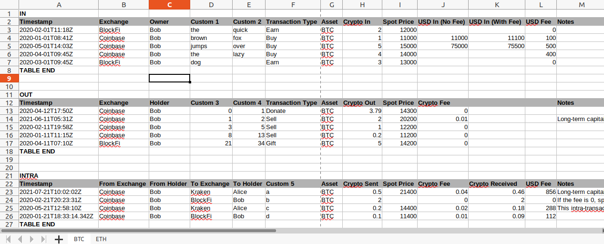

# Input Files: ODS Spreadsheet and Config File
RP2 reads as input two user-prepared files:
- an [ODS-format spreadsheet](#the-input-spreadsheet) (containing crypto transactions)
- a [JSON config file](#the-config-file) (describing the format of the spreadsheet file).

The user fills the input spreadsheet with crypto transactions using records from exchanges and wallets. The user also writes the config file (or they can start with [crypto_example.config](../config/crypto_example.config) as boilerplate) describing the format of the spreadsheet file:
- meaning of columns,
- cryptocurrencies used,
- exchanges used,
- account owners.

See [crypto_example.ods](../input/crypto_example.ods) and [crypto_example.config](../config/crypto_example.config) to learn more.

## The Input Spreadsheet
The input spreadsheet is in .ods format and contains one or more sheets. Each sheet is named after one cryptocurrency and contains all transactions denominated in it (allowed cryptocurrencies are defined in the **assets** section of the config file). Each sheet is composed of the following tables:
* The **IN**-table (mandatory) contains transactions describing crypto flowing in (e.g. buy, earn):
  * the first row contains the **IN** keyword in column A
  * the second row is the table header: the meaning of each header cell is defined in the **in_header** section of the config file
  * the following rows describe one **IN**-transaction each
  * the last row contains the **TABLE END** keyword in column A
* The **OUT**-table (optional) contains transactions describing crypto flowing out (e.g. donate, gift, sell):
  * the first row contains the **OUT** keyword in column A
  * the second row is the table header: the meaning of each header cell is defined in the **out_header** section of the config file
  * the following rows describe one **OUT**-transaction each
  * the last row contains the **TABLE END** keyword in column A
* The **INTRA**-table (optional) contains transactions describing crypto moving across accounts owned by the same person (or multiple people filing taxes together):
  * the first row contains the **INTRA** keyword in column A
  * the second row is the table header: the meaning of each header cell is defined in the **intra_header** section of the config file
  * the following rows describe one **INTRA**-transaction each
  * the last row contains the **TABLE END** keyword in column A

Here follows an example of an input spreadheet with 2 sheets (one for BTC and one for ETH) and 3 tables (IN, OUT and INTRA). Note that in this case the user decided to have some custom columns for their own purposes: these columns must not be referenced in the config file and will be ignored by RP2.
. See also an [ODS spreadsheet example](../input/crypto_example.ods) to learn more.

### **IN**-Transaction Table Format
**IN**-transactions des(ncribe crypto flowing in (e.g. buy, earn) and are contained in the **IN**-table. They have the following parameters (parameter/column mapping is described in the **in_header** section of the config file):
  * **timestamp**: time at which the transaction occurred. RP2 can parse most timestamp formats, but timestamps must always include: year, month, day, hour, minute, second and timezone (milliseconds are optional). E.g.: "2020-01-21 11:15:00+00:00".
  * **asset**: which cryptocurrency was transacted (e.g. BTC, ETH, etc.). It must match the name of the spreadsheet and one of the values in the **assets** section of the config file.
  * **exchange**: exchange or wallet on which the transaction occurred (e.g. Coinbase, Coinbase Pro, BlockFi, etc.). It must match one of the values in the **exchanges** section of the config file.
  * **holder**: exchange account or wallet owner. It must match one of the values in the **holders** section of the config file.
  * **transaction_type**: BUY or EARN.
  * **spot_price**: value of 1 unit of the given cryptocurrency at the time the transaction occurred.
  * **crypto_in**: how much of the given cryptocurrency was acquired with the transaction.
  * **usd_fee**: US dollar value of the transaction fees.
  * **usd_in_no_fee** (optional): US dollar value of the transaction without fees. If not provided, RP2 will compute this value automatically.
  * **usd_in_with_fee** (optional): US dollar value of the transaction with fees. If not provided, RP2 will compute this value automatically.
  * **notes** (optional): user-provided description of the transaction.

### **OUT**-Transaction Table Format
**OUT**-transactions describe crypto flowing out (e.g. donate, gift, sell) and are contained in the **OUT**-table. They have the following parameters (parameter/column mapping is described in the **out_header** section of the config file):
  * **timestamp**: time at which the transaction occurred. RP2 can parse most timestamp formats, but timestamps must always include: year, month, day, hour, minute, second and timezone (milliseconds are optional). E.g.: "2020-01-21 11:15:00+00:00".
  * **asset**: which cryptocurrency was transacted (e.g. BTC, ETH, etc.). It must match the name of the spreadsheet and one of the values in the **assets** section of the config file.
  * **exchange**: exchange or wallet on which the transaction occurred (e.g. Coinbase, Coinbase Pro, BlockFi, etc.). It must match one of the values in the **exchanges** section of the config file.
  * **holder**: exchange account or wallet owner. It must match one of the values in the **holders** section of the config file.
  * **transaction_type**: DONATE, GIFT or SELL.
  * **spot_price**: value of 1 unit of the given cryptocurrency at the time the transaction occurred.
  * **crypto_out_no_fee**: how much of the given cryptocurrency was sold or sent with the transaction (excluding fees).
  * **crypto_fee**: crypto value of the transaction fees.
  * **crypto_out_with_fee** (optional): how much of the given cryptocurrency was sold or sent with the transaction (excluding fees). If not provided, RP2 will compute this value automatically.
  * **usd_out_no_fee** (optional): US dollar value of the transaction without fees. If not provided, RP2 will compute this value automatically.
  * **usd_fee** (optional): US dollar value of the transaction fees. If not provided, RP2 will compute this value automatically.
  * **notes** (optional): user-provided description of the transaction.

### **INTRA**-Transaction Table Format
**INTRA**-transactions describe crypto moving across accounts owned by the same person and are contained in the **INTRA**-table. They  have the following parameters (parameter/column mapping is described in the **intra_header** section of the config file):
  * **timestamp**: time at which the transaction occurred. RP2 can parse most timestamp formats, but timestamps must always include: year, month, day, hour, minute, second and timezone (milliseconds are optional). E.g.: "2020-01-21 11:15:00+00:00".
  * **asset**: which cryptocurrency was transacted (e.g. BTC, ETH, etc.). It must match the name of the spreadsheet and one of the values in the **assets** section of the config file.
  * **from_exchange**: exchange or wallet from which the transfer of cryptocurrency occurred (e.g. Coinbase, Coinbase Pro, BlockFi, etc.). It must match one of the values in the **exchanges** section of the config file.
  * **from_holder**: owner of the exchange account or wallet from which the transfer of cryptocurrency occurred. It must match one of the values in the **holders** section of the config file.
  * **to_exchange**: exchange or wallet to which the transfer of cryptocurrency occurred (e.g. Coinbase, Coinbase Pro, BlockFi, etc.). It must match one of the values in the **exchanges** section of the config file.
  * **to_holder**: owner of the exchange account or wallet to which the transfer of cryptocurrency occurred. Typically this is the same value as from_holder (unless multiple people are filing taxes together). It must match one of the values in the **holders** section of the config file.
  * **spot_price** (optional): value of 1 unit of the given cryptocurrency at the time the transaction occurred. Sometimes if fee is zero, exchanges don't provide this value.
  * **crypto_sent**: how much of the given cryptocurrency was sent with the transaction.
  * **crypto_received**: how much of the given cryptocurrency was received with the transaction.
  * **notes** (optional): user-provided description of the transaction.

## The Config File
The config file tells RP2 how to interpret the input spreadsheet (i.e. what values are contained in what column). The purpose of the config file is input flexibility: unfortunately exchanges don't provide user transaction data in a standardized way, so customizing column positions can be useful. See an [example of config file](../config/crypto_example.config) to learn more.

The config file is in JSON format and is structured as described below. Note that:
- header descriptions are given in the [input spreadsheet section](#the-input-spreadsheet);
- optional elements are marked with &#x1F537;;
- *`<...>`* must be substituted with user-provided values, and, specifically, *`<column_number>`* must be substituted with 0 for column A in the input spreadsheet, 1 for B, etc;
- the `exchanges` section can contain both exchange and wallet identifiers;
- the `holders` section typically contains only one name, unless multiple people are filing taxes together;
<pre>
{
    "in_header": {
        "timestamp": <em>&lt;column_number&gt;</em>,
        "asset": <em>&lt;column_number&gt;</em>,
        "exchange": <em>&lt;column_number&gt;</em>,
        "holder": <em>&lt;column_number&gt;</em>,
        "transaction_type": <em>&lt;column_number&gt;</em>,
        "spot_price": <em>&lt;column_number&gt;</em>,
        "crypto_in": <em>&lt;column_number&gt;</em>,
        "usd_fee": <em>&lt;column_number&gt;</em>,
        "usd_in_no_fee": <em>&lt;column_number&gt;</em>,&#x1F537;
        "usd_in_with_fee": <em>&lt;column_number&gt;</em>,&#x1F537;
        "notes": <em>&lt;column_number&gt;</em>&#x1F537;
    },

    "out_header": {
        "timestamp": <em>&lt;column_number&gt;</em>,
        "asset": <em>&lt;column_number&gt;</em>,
        "exchange": <em>&lt;column_number&gt;</em>,
        "holder": <em>&lt;column_number&gt;</em>,
        "transaction_type": <em>&lt;column_number&gt;</em>,
        "spot_price": <em>&lt;column_number&gt;</em>,
        "crypto_out_no_fee": <em>&lt;column_number&gt;</em>,
        "crypto_fee": <em>&lt;column_number&gt;</em>,
        "crypto_out_with_fee": <em>&lt;column_number&gt;</em>,&#x1F537;
        "usd_out_no_fee": <em>&lt;column_number&gt;</em>,&#x1F537;
        "usd_fee": <em>&lt;column_number&gt;</em>,&#x1F537;
        "notes": <em>&lt;column_number&gt;</em>&#x1F537;
    },

    "intra_header": {
        "timestamp": <em>&lt;column_number&gt;</em>,
        "asset": <em>&lt;column_number&gt;</em>,
        "from_exchange": <em>&lt;column_number&gt;</em>,
        "from_holder": <em>&lt;column_number&gt;</em>,
        "to_exchange": <em>&lt;column_number&gt;</em>,
        "to_holder": <em>&lt;column_number&gt;</em>,
        "spot_price": <em>&lt;column_number&gt;</em>,&#x1F537;
        "crypto_sent": <em>&lt;column_number&gt;</em>,
        "crypto_received": <em>&lt;column_number&gt;</em>,
        "notes": <em>&lt;column_number&gt;</em>&#x1F537;
    },

    "assets": [
        <em>&lt;"asset_1_in_quotes"&gt;</em>,
        ...&#x1F537;
        <em>&lt;"asset_n_in_quotes"&gt;</em>&#x1F537;,
    ],
    "exchanges": [
        <em>&lt;"exchange_or_wallet_1_in_quotes"&gt;</em>,
        ...&#x1F537;
        <em>&lt;"exchange_or_wallet_n_in_quotes"&gt;</em>&#x1F537;,
    ],
    "holders": [
        <em>&lt;"holder_1_in_quotes"&gt;</em>,
        ...&#x1F537;
        <em>&lt;"holder_n_in_quotes"&gt;</em>&#x1F537;,
    ]
}
```