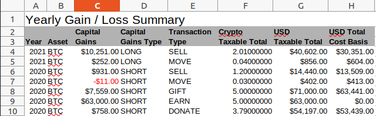
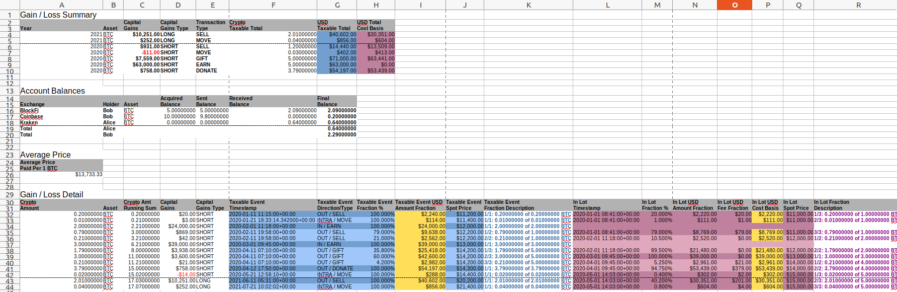
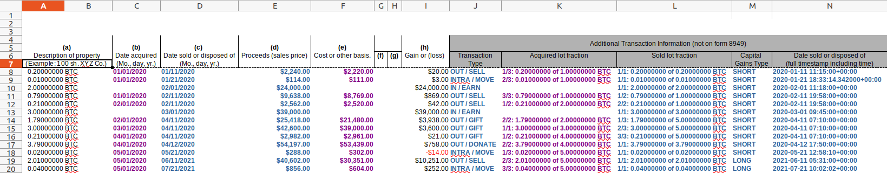

# Output Files
RP2 generates output files based on the output plugins that are present in the plugin directory. Currently two plugins are supported:
- *rp2_report*: a comprehensive report containing full transaction history, long/short capital gains, cost bases, balances, average price, in/out lot relationships and fractions. See [crypto_example_rp2_report_golden.ods](../input/golden/crypto_example_rp2_report_golden.ods) (an example of this output for input file [crypto_example.ods](../input/crypto_example.ods)) and screenshots further down in this document.
- *mock_8949_us*: a US-specific report that can be used to fill form 8949. See [crypto_example_mock_8949_us_golden.ods](input/golden/crypto_example_mock_8949_us_golden.ods) (an example of this output for input file [crypto_example.ods](../input/crypto_example.ods)) and screenshots further down in this document.

After running RP2, the output files can be found in the output directory or in the directory specified with the -o command line option.

## RP2 Report Output
The rp2_report output file is a comprehensive, ODS-format report containing full details on the computed taxes. It contains:
- a *Legend* sheet explaining the meaning of each column and keyword
- a *Summary* sheet containing total short/long term capital gains per year, per cryptocurrency. Here follows an example of this sheet: 
- two sheets per cryptocurrency:
  - *cryptocurrency* In-Out: full transaction history for the given *cryptocurrency*, organized by direction (In, Out, Intra). Taxable events are shown in blue, with taxable amount in yellow. The *In* table has a *Sent/Sold* column showing which lots have been fully or partially sold (in purple). Additionally, timestamps are homogenized (in the user input spreadsheet they may have different formats), transactions are sorted by time and some running sums are computed. Here follows an example of this sheet: 
  - *cryptocurrency* Tax: long/short capital gains, cost bases, balances, average price, in/out lot relationships and fractions for the given *cryptocurrency*. In this sheet blue refers to taxable events and outgoing (sold, donated, etc.) transactions, purple refers to cost basis and incoming (purchased, received) transactions and yellow refers to taxable amount. Here follows an example of this sheet: 

## Mock 8949 US Output
This ODS-format output is US-specific and can be used to fill form 8949. The left part (with white header) mimics form 8949 and it contains information on the transactions that had taxable events: their cost basis, capital gains, proceeds, etc. The right part (with grey header) contains additional information (not part of form 8949) that can be useful in identifying the transactions in the user's records: full timestamp of date sold, capital gains type (long or short), lot fraction information, transaction type, etc. In this sheet blue refers to taxable events and outgoing (sold, donated, etc.) transactions and purple refers to cost basis and incoming (purchased, received) transactions. Here follows an example of this sheet: 

