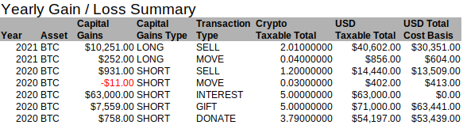
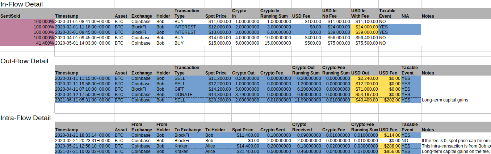
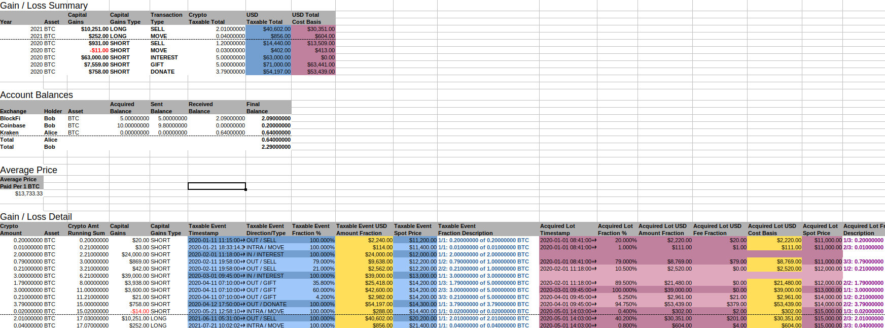
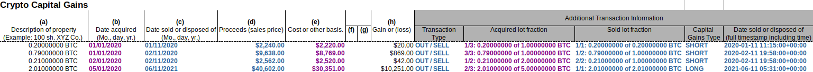
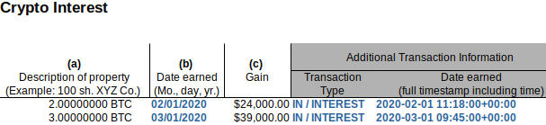

<!--- Copyright 2021 eprbell --->

<!--- Licensed under the Apache License, Version 2.0 (the "License"); --->
<!--- you may not use this file except in compliance with the License. --->
<!--- You may obtain a copy of the License at --->

<!---     http://www.apache.org/licenses/LICENSE-2.0 --->

<!--- Unless required by applicable law or agreed to in writing, software --->
<!--- distributed under the License is distributed on an "AS IS" BASIS, --->
<!--- WITHOUT WARRANTIES OR CONDITIONS OF ANY KIND, either express or implied. --->
<!--- See the License for the specific language governing permissions and --->
<!--- limitations under the License. --->

# Output Files
RP2 generates output files by running the output plugins. It comes with two builtin plugins for US taxes:
* *rp2_full_report*: a comprehensive report containing full transaction history, long/short capital gains, cost bases, balances, average price, in/out lot relationships and fractions. See [crypto_example_rp2_full_report.ods](../input/golden/crypto_example_rp2_full_report.ods) (an example of this output for input file [crypto_example.ods](../input/crypto_example.ods)) and screenshots further down in this document.
* *tax_report_us*: a US-specific report that can be used to fill form 8949, etc. See [crypto_example_tax_report_us.ods](../input/golden/crypto_example_tax_report_us.ods) (an example of this output for input file [crypto_example.ods](../input/crypto_example.ods)) and screenshots further down in this document.

After running RP2, the output files can be found in the `output` directory or in the directory specified with the -o command line option.

## RP2 Full Report Output
The rp2_full_report.ods output file is a comprehensive, ODS-format report containing full details about the computed taxes. It contains:
* a *Legend* sheet explaining the meaning of each column and keyword
* a *Summary* sheet containing total short/long term capital gains per year, per cryptocurrency. Here follows an example of this sheet: 
* two sheets per cryptocurrency:
  * *cryptocurrency* In-Out: full transaction history for the given *cryptocurrency*, organized by direction (In, Out, Intra). Taxable events are shown in blue, with taxable amount in yellow. The *In* table has a *Sent/Sold* column showing which lots have been fully or partially sold (in purple). Timestamps are homogenized (in the user input spreadsheet they may have different formats), transactions are sorted by time and some running sums are computed. Here follows an example of this sheet: 
  * *cryptocurrency* Tax: long/short capital gains, cost bases, balances, average price, in/out lot relationships and fractions for the given *cryptocurrency*. In this sheet, blue refers to taxable events and outgoing (sold, donated, etc.) transactions, purple refers to cost basis and incoming (purchased, received) transactions and yellow refers to taxable amount. The Intra-Flow Detail table shows the mapping between taxable event fractions and in-transaction fractions. Here follows an example of this sheet: 

## Tax Report US Output
The tax_report_us.ods output file contains a sheet per taxable event type (if there are not taxable events for a given event type, it's relative sheet is not generated):
* Airdrops;
* Capital Gains (triggered by cryptocurrency sales);
* Donations (cryptocurrency given to a qualified charity);
* Gifts (cryptocurrency gifted to a friends or family);
* Hard Forks;
* Interest;
* Investment Expenses (cryptocurrency fee paid when moving funds between two accounts owned by the same person);
* Mining;
* Staking;
* Wages.

These sheets are in the format of form 8949 and are meant for tax professionals, who can use it fill the appropriate forms. Every line corresponds to a taxable event and describes it. The left part (with white header) mimics form 8949: cost basis, capital gains, proceeds, etc. The right part (with gray header) contains additional information that can be used to identify the transactions in the user's records or in the [rp2_full_report output](#rp2-full-report-output): full timestamp of date sold, capital gains type (long or short), lot fraction information, transaction type, etc. In this sheet blue refers to taxable events and purple to in-transactions (purchased, earned, etc.).

Here follows an example of the Capital Gains sheet: 

And an example of the Interest sheet: 
